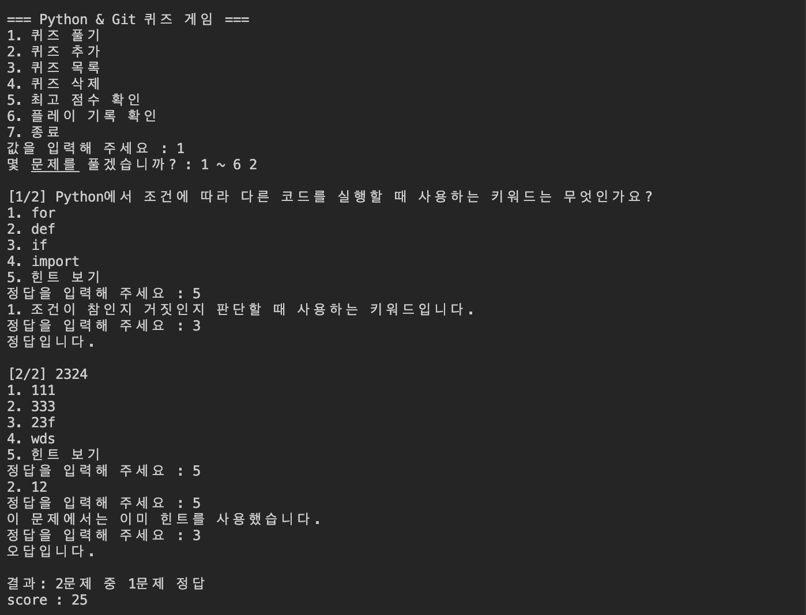
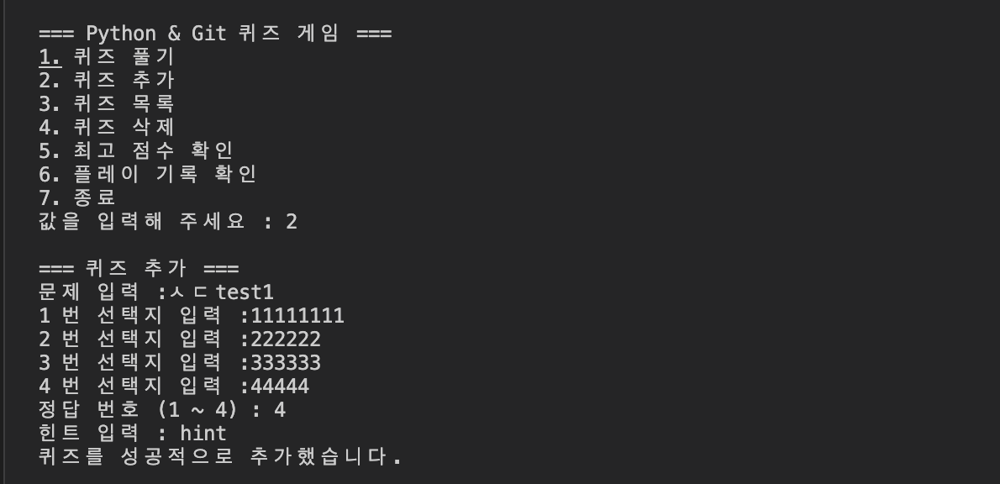
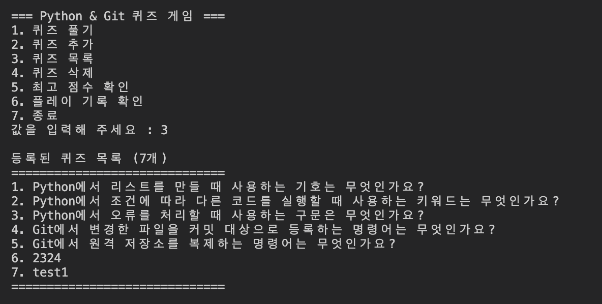
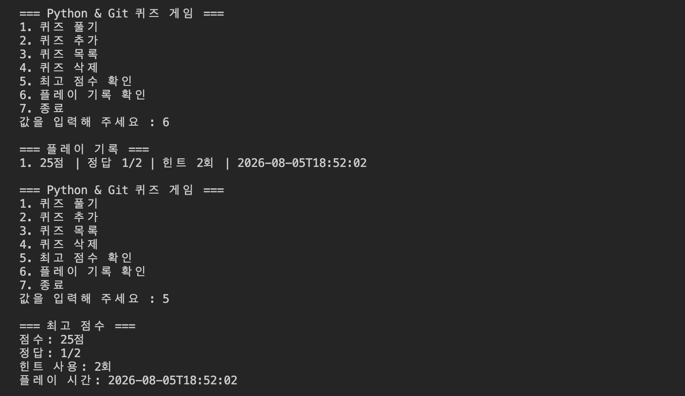
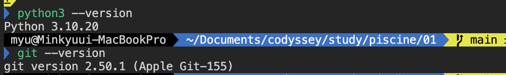
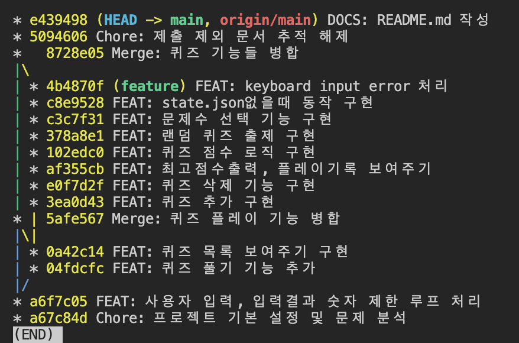
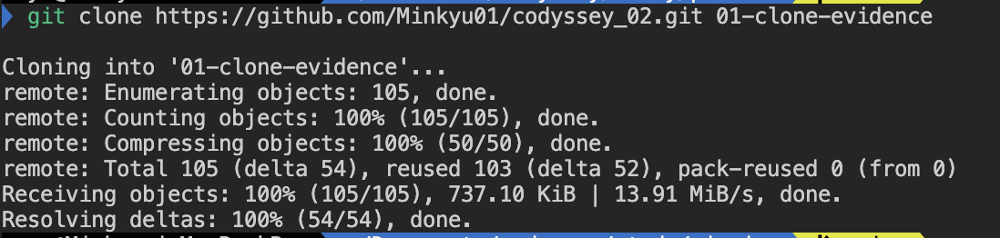

# 프로젝트 개요

Python 기초와 Git 개념을 주제로 한 사지선다형 콘솔 퀴즈 게임입니다. 이 주제는 과제를 구현하면서 사용하는 자료형, 조건문, JSON, Git 명령을 문제로 다시 복습하기 위해 선택했습니다.

프로그램은 기본 퀴즈 5개를 제공하며 퀴즈 풀기, 추가, 목록 조회, 최고 점수 조회 기능을 지원합니다. 추가한 퀴즈와 최고 점수는 프로젝트 루트의 `state.json`에 저장되어 재실행 후에도 유지됩니다.

## 퀴즈 주제 선정 이유
퀴즈 게임을 구현하면서 사용하는 Python 기초 문법과 Git 명령어를 자연스럽게 복습하기 위해 이 주제를 선택했습니다. 리스트, 조건문, 예외 처리와 git add, git clone 같은 핵심 개념을 문제로 풀면서 개발 과정에 필요한 내용을 함께 익힐 수 있습니다.

#### 실행 방법
Python 3.10 이상 사용해야 한다.

Python 버전을 확인합니다.
```bash
python3 --version
```

프로젝트 루트에서 프로그램을 실행합니다.
```bash
python3 main.py
```

## 기능목록

1. 선택한 퀴즈들 풀기와 정답·오답 피드백
2. 문제, 선택지 4개, 정답 번호를 입력해 퀴즈 추가
3. 저장된 퀴즈 목록 조회
4. 최고 점수 조회 및 갱신
5. 데이터 저장 후 종료
6. 퀴즈 랜덤 출제
7. 입력 에러 처리
8. 힌트 확인과 힌트 사용 시 감점
9. 퀴즈 삭제

## 파일 구조

```text
01/
├── README.md                       # 프로젝트 사용 및 제출 안내
├── main.py                         # 실행 진입점
├── state.json                      # 퀴즈 데이터
├── .gitignore                      # git에 올리면 안되는 파일들 목록
└── classes/
    ├── __init__.py                 # classes 폴더를 Python 패키지로 다루기 위한 파일
    ├── quiz.py                     # quiz의 클래스 구조
    └── quizgame.py                 # 전반적인 quizgame의 게임 구현 
    └── play_record.py              # 게임 기록 구조화 
    └── state_store.py              # json 읽고 쓰기
```

## 데이터 파일 설명


#### 경로

`state.json`은 `main.py`와 같은 프로젝트 루트에 저장됩니다.

```text
01/
├── main.py
└── state.json
```

#### 역할

`state.json`은 퀴즈와 플레이 결과를 저장하는 UTF-8 JSON 파일입니다. 프로그램을 종료한 후 다시 실행해도 추가·삭제한 퀴즈, 최고 기록과 플레이 기록을 유지하기 위해 사용합니다.

파일이 없거나 데이터가 손상된 경우에는 기본 퀴즈 데이터로 초기화합니다.

#### 스키마

```json
{
  "quizzes": [
    {
      "question": "문제 내용",
      "choices": [
        "선택지 1",
        "선택지 2",
        "선택지 3",
        "선택지 4"
      ],
      "answer": 1,
      "hint": "힌트 내용"
    }
  ],
  "best_record": {
    "played_at": "2026-08-05T14:10:47",
    "total": 5,
    "correct": 4,
    "hints_used": 1,
    "score": 70
  },
  "history": []
}
```

- `quizzes`: 등록된 퀴즈 목록
- `question`: 문제 내용
- `choices`: 선택지 4개
- `answer`: 정답 번호(1~4)
- `hint`: 힌트 내용
- `best_record`: 최고 점수를 얻은 플레이 기록
- `history`: 완료한 모든 플레이 기록
- `played_at`: 플레이한 날짜와 시간
- `total`: 풀이한 문제 수
- `correct`: 맞힌 문제 수
- `hints_used`: 사용한 힌트 수
- `score`: 최종 점수(0~100)

아직 플레이 기록이 없다면, 전체 데이터 중 기록 관련 필드는 다음과 같습니다. 실제 `state.json`에는 `quizzes`도 함께 저장됩니다.
```json
{
  "best_record": null,
  "history": []
}
```


#### 스크린샷
- 플레이 화면


- 퀴즈 추가 -> 아래 목록 화면에 추가됨


- 퀴즈 목록 출력


- 최고점수 및 플레이 기록 확인


- git, python version


- git log --oneline --graph 결과 스크린샷


- git clone 실습


---
- GitHub 저장소: https://github.com/Minkyu01/codyssey_02
